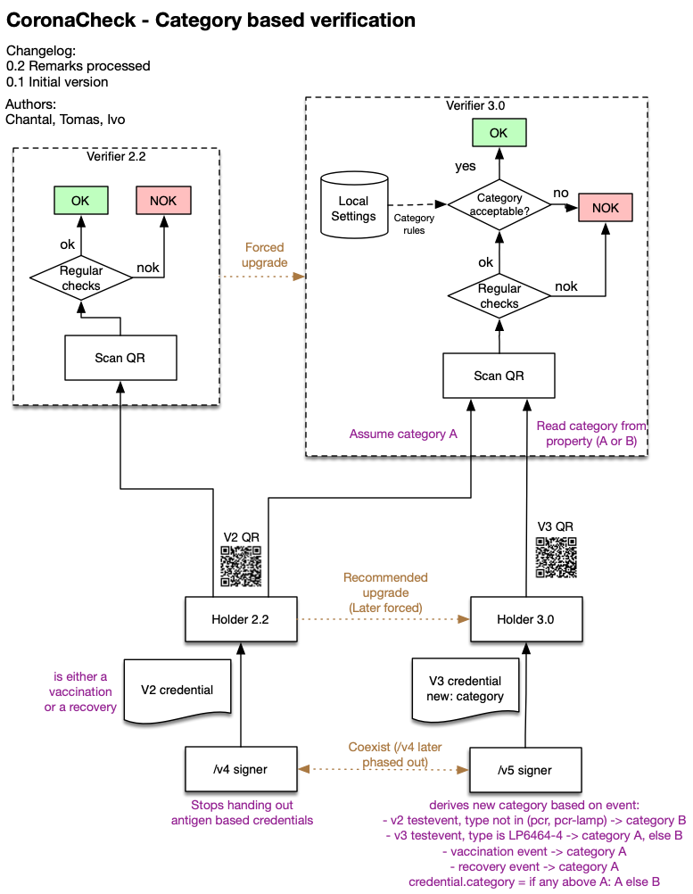

# Category based Verification

## Introduction

The Scanner for CoronaCheck app currently validates Domestic QR codes against a fixed set of business rules. To accommodate a more granular way of verifying QR codes depending on changing circumstances, a new `category` field is proposed that can be used to apply a different set of rules based on the given category.

This could be used for cases where, for some events or locations, other access rules apply. These locations would then use a new setting in the CoronaCheck Scanner app to select the categories they support.

The QR codes, upon issuance, are given a specific category based on a set of yet to be determined business rules. 

This document outlines the change to the flow to accommodate such a category.

## Flow

The following diagram depicts the changed flow. Hypothetical categories 'A' and 'B' are used, with an example business rule set that uses the test type to distingish between A and B.

As can be seen in the diagram, the current scanners would assume a certain category for existing QR codes (in this case category A). The following chapter describes the migration process.

## Migration

**Apps**

At time of release of the category field, 2 versions of holder and verifier apps would be in the field. Since a new field in the QR is not backward compatible old verifier apps will refuse the new QR codes. Therfor it's important to do the release process in a number of phases:

1. First deploy a new verifier app that can understand both old and new QR credential versions.
2. After a few days the verifier is forced-updated to this new version to ensure new QRs are accepted everywhere.
3. Next, release a new holder app that can understand new QR credentials.
4. In the signer, 2 endpoints should be provided. 
    1. The /v4 endpoint is the current issuer, which hands out old QRs without category field. These QRs can be read by any version of the holder and verified by any version of the verifier.
    2. The /v5 endpoint is the new issuer, which hands out new QRs with category field. Only new holders will use this endpoint and can understand QRs with this new field.
5. The holder app can be recommended-upgraded to the new version, to aid phase out of older QR codes.    
  
**Paper**

Since paper has a longer validity, current papers are continued to be supported by the new verifier app. The verifier app will assume a category for all paper based on a predetermined preset.

